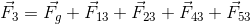
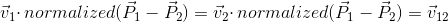

[](https://travis-ci.org/amidukr/cpp-bridge-v5) [](https://codecov.io/gh/amidukr/cpp-bridge-v5)


# Project Overview

This project is sample implementation for matrix based soft-body dynamic modeling for mesh with infinite stiffness.

The intention of this project is to prove that use of system of linear equation (Elastic Matrix model) for calcualation of force strength distribution accross soft-body model will give better accuracy than classical elastic model on larger simulation time interval

## Goal

The goal for modeling is to create soft-body dyanmic algorithms with infinitly hard connected mesh which will give steady and accurate result on large simulation intervals.

Matrix-Elastic model is considered as most advanced algorithm used in this study, and it is a target to be proove that it will give better result than just plain Elastic model.


# Modeling

Application can run in 3 different mathematic modeling mode to simulate dyanmic process in mesh model.

- Matrix - assumes that model is stiff and uses system of linear equation to calculate Force distribution considering bridge model as whole system. This modeling is syntesis of two algorithms: Matrix and Kinematics/Dynamics.
- Elastic - assume that model is elastic. This modeling is syntesis of two algorithms: Kinematics/Dynamicsa and Principle of minimum energy, while gravity shifting the positions of the model.
- Matrix-Elastic - combination of Matix and Elastic algorithm to get best results. This modeling is syntesis of three algorithms: Matrix, Principle of minimum energy and Kinematics/Dynamics.

## Bridge Model Mesh

Bridge model is presented by series:

- Floating junctions with mass, example: P1, P2, P3, P5
- Fixed junction: Example P4
- And connection between this junctions


## Bridge Model Dynamic

Expectation that mesh model will be dynamically in motion according to physics law.
- So floating junction can change its velocity and position
- Floating junction have a mass and inertion.
- Fixed junction will have fixed position, zero velocity, infinite mass and inertion staying fixed all the time.
- Gravity force is applied everytime for every Free floating junctions
- Connection are non-ideally elastic, however the target for evaluation is that connection should be as harder as possible.

Expected behaviour for the sample above is that mass junction P1, P2, P3, P5 will be in falling and rotation around fixed point P4.

# Algorithms
## Kinematics and Dynamics

Dynamic for soft-body modeling makes an assumption that body presented as set of junction connected with elastic springs, that behaves according to [Hooke's law](https://en.wikipedia.org/wiki/Hooke%27s_law).

Every floating junction is accelerated based on applied force that is gravity and spring tension forces.

Let's assume that:
-  is a mass of Junction Pi
-  is superposition of forces applied to Junction Pi,
velocity will be update for each iteration in following way:
-  is position of Junction Pi.
-  is velocity of Junction Pi at current moment of time.
-  is velocity of Junction Pi at next moment after
inteval .
-  is position of Junction Pi at next moment after
interval .

Having the , , ,
 and  next state of Junction Pi can be calculated with
following formula:

- 
- 
-  - according to Newton's second law

Example bellow illustrates force applied to Junction P3


-  - superposition of forces applied to Junction P3.
-  - Gravity force
-  - force applied applied to junction P3 by spring 23 tension. Same symetrical force
 with opposit direction applied to junction P2.



## Hook's Law
Spring tension force is calculated according to [Hooke's law](https://en.wikipedia.org/wiki/Hooke%27s_law). Illustration bellow demonstrates Hooke's law. However direct definition of Hoke's law is not used in this application, because Minimum Energy algorithm is enough to simulate elastic model.

-  is commpressed state of spring.
-  is relaxed state of spring.


Spring tension force can be calculated with following formula
- ; according to 
[Hooke's law](https://en.wikipedia.org/wiki/Hooke%27s_law)
- 

## Minimum Energy
[Principle of minimum energy](https://en.wikipedia.org/wiki/Principle_of_minimum_energy) it states that the internal energy will decrease and approach a minimum value at equilibrium. 

In soft-body simulation model simulation case internal energy is spring tension, and iterative algorithm searchs for the equilibrium state with minimum tension and minimum internal energy.


Algorithm that implements principle of minimum energy is illustrated on the image bellow.


Let's assume that
-  - is current  position of Junction P1. It also represent the current state of the model. In this case tension of the spring will tend to accelerate Junction P1 to the direction close to 
. This state needs store internal energy as spring tension, and needs to be optimized according to 
[Principle of minimum energy](https://en.wikipedia.org/wiki/Principle_of_minimum_energy)
-  is ideal target position of junction P1, which is practically impossible. It represent relaxed state of the model, that means that all spring tension forces are equal to zero, in this state
 and system is in equilibrium state. We can say that this is the state of minimum energy, where no internal energy stored by the springs.
-  and  is intermediate Junction P1
position during algorithm run on iteration 1 and iteration 2, while the last step is result of algorithm. For generalc case amount of steps for each junction is variable and depends on amount of spring connected to this junction.
  -  represent algorithm iteration related to Junction P1 and Spring that connection
  Junction P1 and Junction P2
  -  represent algorithm iteration related to Junction P1 and Spring that connection
  Junction P1 and Junction P3


Principle of the algorithm is to iterate over every Floating Junctions and every Spring Connected to the Junction. These iteration can be repeated multiple time, to come closer to ideal relaxed state. On every step of the iteration over Spring related to Floating Junction, just needs to move Floating Junction in the direction to relaxate that Spring to achieve the state of minimum energy. Formula exmaples for the illustration above:
- 
- 
 
 0.5 factor is applied to the formulas, because algorithm moves Junction symetrically on both ends of the spring. Half move on Junctions on both ends will make a whole change to the spring.

## Matrix

Intention to create this application is to prove that Matrix algorithm will show better resulst than classical elastic. Concept of this algorithm is that forces and tension in real world construction a spread immediately all objects are interact with each other and even the most remote ones.

Matrix are good to describe systems that can be defined as system of linear equation, where root are states of the objects and each of this states is dependent and affected by every other object and object's states.

In the Matrix algorithm, there is assumption that connection between junction are extremely hard spring with Hook's factor about infinity, and forces between junctions are spread immediately. To do the soft body dynamics modeling, matrix is used find force superposition applied to every Junction. Matrix algorithm is explained using Model bellow:


On this model two type of Junction:

- P3, P4 - fixed junction, has infinity mass and inertion can accept any force or impulse without moving.
- P1, P2 - floating junction have some mass and moving.

Let's assume that:
- ,  - force applied to Junction P1 and Junction P2 accordingly. And these forces will make acceleration to Junction P1, P2.
-  - gravity force
- , , 
is forces applied to P2 by P1, P3 by P1 and P4 by P2 accordingly.
- , ,  is force applied to P1 by P2, P1 by P3, P2 by P4 and equal to -, -, - accordingly.
- , , , 
 is positions of Junction Points P1, P2, P3, P4 accordingly.
- , , 
are normalized vectors connecting Junctions, and can be calculated as 
,
 and 
 accordingly.

Next steps to build the system of linear equation that represent Bridge Model as interacting system, where the roots will be the Forces necessary to calculate Junction accelerations. 

1. Force applied to every Junction can be calculated as sum of forces applied by connection between Junctions and Gravity. For example model above formula will looks like follows:
   - 
   - 
 
   or   
   
   - 
   - 
   
   or
   
   - 
   - 
2. Rotation of the sysetm of two Junction and Connection between them is also constrained by following formula. Mahematical Prove of [Girder Rotation](#girder-rotation) is providen bellow.
   - Junction 13 and Junction 24 has one fixed and one floating junction so the formulas are follows:
     - 
     - 
   - Connection 12 has two floating junction, so formula is follows:
     - 

Resulting matrix for the equations above, will look like follows:


For general case for N Junction and M connection Matrix still will be square. For every Junction it will be two equation plus
one equation for each connection. The same amount of roots: two roots for every Junction superposition force and one root for
every connection tension.

### Girder Rotation

Here are two cases to review rotation of girder over fixed junction, and free rotation with two floating junction.

1. Rotation over fixed girder is simple case, floating point can be accelerated only in the direction perpendicular to the connection.

   
   
   Since force othogonal to connection, Dot product of these two should be equal to zero:
   - 
   
   or 
   
   - 

2. Describing constraint for connection with floating junction, needs to consider that connection length is constant, and velocity of junctions on both ends can't change connection length. 

   
   
   It means that decomposed part of vector which collinear with connection for both end should have same value, otherwise 
   connection length will be changed.
   - 
   
   or
   
   - 
   
   Same true for vector next moment of time
   - 
   
   Simplifying equation:
   - 
   - 
   
   Same true for force and acceleration
   - 
   - 
   - 
   
   
   Linear equation format, suitable for matrix:
   - 
  
   or
  
   - 

# Simulation Configurations

Simulation configuration provides an option to run modeling with different time factor.

- Optimal - provide most accurate simulation resul
- 10x - time factor set to 10x 
- 100x - time factor set to 100x 

# Video Recordings

## Pandulum - 100x

| Modeling       | Aesthetics    | Firnmess | Friction | Accuracy | Total |
|----------------|---------------|----------|----------|----------|-------|
| Matrix Elastic | 1             | 1        | 1        | 2        | 3     |
| Elastic        | 0             | 1        | 0        | 1        | 1     |
| Matrix         | 1             | 1        | 1        | 2        | 3     |

[](https://youtu.be/CZ_dfPfVO-M "Pandulum 100x")

## Line - 100x

| Modeling       | Aesthetics    | Firnmess | Friction | Accuracy | Total |
|----------------|---------------|----------|----------|----------|-------|
| Matrix Elastic | 2             | 2        | 2        | 4        | 6     |
| Elastic        | 1             | 1        | 1        | 2        | 3     |
| Matrix         | 0             | 0        | 0        | 0        | 0     |

[](https://youtu.be/uTghom1pDSs "Line 100x")

## Line - 10x

| Modeling       | Aesthetics    | Firnmess | Friction | Accuracy | Total |
|----------------|---------------|----------|----------|----------|-------|
| Matrix Elastic | 2             | 2        | 3        | 5        | 7     |
| Elastic        | 2             | 1        | 2        | 3        | 5     |
| Matrix         | 1             | 1        | 1        | 2        | 3     |

[](https://youtu.be/27WBwdrFHrE "Line 10x")

## Line - Optimal

| Modeling       | Aesthetics    | Firnmess | Friction | Accuracy | Total |
|----------------|---------------|----------|----------|----------|-------|
| Matrix Elastic | 3             | 1        | 1        | 2        | 5     |
| Elastic        | 2             | 1        | 1        | 2        | 4     |
| Matrix         | 1             | 1        | 2        | 3        | 4     |


[](https://youtu.be/B3NJsNYoTu0 "Line Optimal")

## Triangle Grid - Optimal

| Modeling       | Aesthetics    | Firnmess | Friction | Accuracy | Total |
|----------------|---------------|----------|----------|----------|-------|
| Matrix Elastic | 1             | 1        | 2        | 3        | 4     |
| Elastic        | 1             | 1        | 1        | 2        | 3     |
| Matrix         | 1             | 1        | 3        | 4        | 5     |

[](https://youtu.be/r9zhTKDoSyk "Triangle Grid Optimal")


## Triangle Grid - 10x

| Modeling       | Aesthetics    | Firnmess | Friction | Accuracy | Total |
|----------------|---------------|----------|----------|----------|-------|
| Matrix Elastic | 1             | 1        | 1        | 2        | 3     |
| Elastic        | 0             | 0        | 0        | 0        | 0     |
| Matrix         | 1             | 1        | 2        | 3        | 4     |


[](https://youtu.be/ru1z6gKe6f0 "Triangle Grid 10x")


## Triangle Grid - 100x

| Modeling       | Aesthetics    | Firnmess | Friction | Accuracy | Total |
|----------------|---------------|----------|----------|----------|-------|
| Matrix Elastic | 2             | 2        | 1        | 3        | 5     |
| Elastic        | 0             | 0        | 0        | 0        | 0     |
| Matrix         | 0             | 1        | 1        | 2        | 2     |


[](https://youtu.be/l2fo0-HfS_I "Triangle Grid 100x")

## Swing - Optimal

| Modeling       | Aesthetics    | Firnmess | Friction | Accuracy | Total |
|----------------|---------------|----------|----------|----------|-------|
| Matrix Elastic | 1             | 1        | 2        | 3        | 4     |
| Elastic        | 1             | 1        | 1        | 2        | 3     |
| Matrix         | 1             | 1        | 3        | 4        | 5     |


[](https://youtu.be/_G4N5KpsYAo "Swing Optimal")

## Rope - 10x

| Modeling       | Aesthetics    | Firnmess | Friction | Accuracy | Total |
|----------------|---------------|----------|----------|----------|-------|
| Matrix Elastic | 2             | 2        | 1        | 3        | 5     |
| Elastic        | 1             | 1        | 2        | 3        | 4     |
| Matrix         | 0             | 0        | 0        | 0        | 0     |

[](https://youtu.be/UrLe8GCPYH8 "Rope 10x")

## Total

| Modeling       | Aesthetics    | Firnmess | Friction | Accuracy | Total |
|----------------|---------------|----------|----------|----------|-------|
| Matrix Elastic | 15            | 13       | 14        | 27      | 42    |
| Elastic        | 8             | 7        | 8         | 15      | 23    |
| Matrix         | 6             | 7        | 13        | 20      | 26    |

# Analysis

## Scoring

Scoing on presented video samples are provided in 3 categories:
- Aesthetics - general impression if the simulation looks natural and smooth.
- Acuracy - combination of Firmness and Friction, technical evaluation if modeling fits to the goals.
  - Firmness - less deformation is better. Object that will keep original size of connection will get extra score.
  - Friction - less frictions is better. Object that will swing to base position will get extra score.

## Conclusion

Matrix-Elastic prove that it performs better in both scorings Aesthetical and Accuracy, while Elastic looks more natural Matrix has smaller frictions.

For Triangle Grid model which is closer to simulation plane surface elastic model failed the test completely, while Matrix Elastic looks natural.


## Possible improvement

Matrix Elastic looks natural and aesthetically, while matrix modeling prooved that it can be used for accurate force calcualtion, however there are still exist possibilities to improve simulation:
1. More accurately Matrix does a calculation for force momentum rather than just a force, because junction is connected to another junction, and can move only with cirucal curve around other junction it connected to, so to improve simulation, model positions should be constrained to the original connection length, which also can be presetned as system of equations: sqrt((Pi + dPi) - (Pj + dPj)) = relaxed_spring_length(Pi, Pj), while force momentum is already calculated.
2. Matrix general pattern is also looks natural and smooth, while junction point are vibrating around accurate position, for this reason presented junction point can be averaged using position of previouse steps.

# Application Usage Manual
## Command Line Help

To get a help please use -h flag for the application:

```text
  ./cpp_bridge_v5_app_executable [simulations...] {OPTIONS}

    Application that demonstates soft-body dynamics modeling.

  OPTIONS:

      -h, --help                        Display this help menu
      -s, --help-simulation             Display help for simulation commands
      -l, --headless                    Run in headless mode
      -t, --test                        Run self-testing scenarios
      --gtest_filter=[gtest_filter]     Run self-testing scenarios
      -v, --video                       Write simulation to video file
      simulations...                    Simulation models, use help-simulation
                                        for more information
      "--" can be used to terminate flag options and force all following
      arguments to be treated as positional options
```

## Build Instruction

CMake is used to build the project.

1. Consider that all necessary depdenencies are installed in the system
2. Than run following cmake command from projet source folder:
   ```bash
   mkdir build
   cd build
   cmake -S .. -B .
   cmake --build .
   ```
3. Run tests to check that application is build properly
   ```
   ./cpp_bridge_v5_app_executable -t
   ```

# Contacts

For any questions please contact amid.ukr@gmail.com

